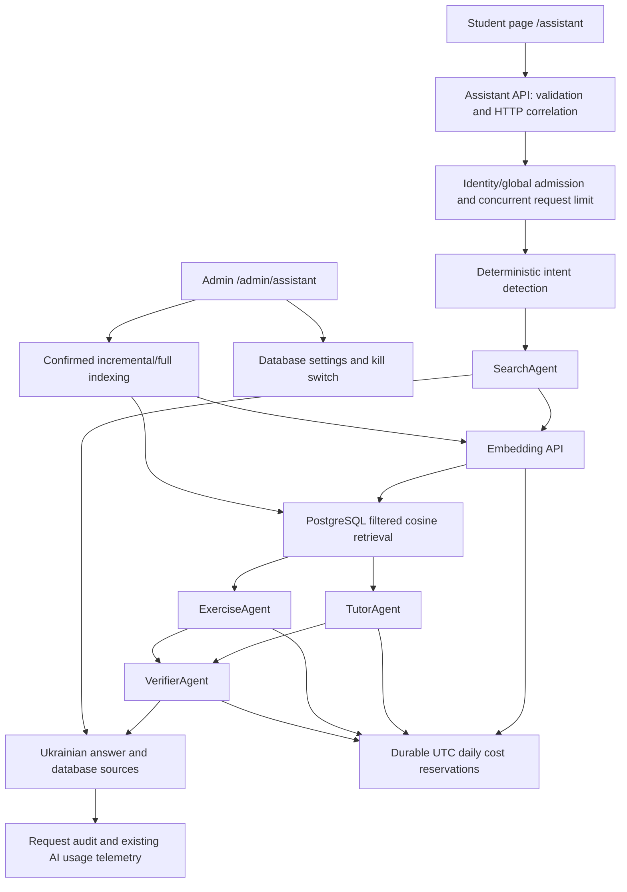

# Student AI assistant

## Architecture and execution

This feature extends the existing .NET Application/Infrastructure/API layers, React UI, PostgreSQL storage, OpenAI configuration, pricing calculator and AI usage telemetry. It adds no external vector service or paid infrastructure. Existing administrator material analysis and image transformation remain separate operations.



1. Validate question length, grade (5–11), topic and request body size.
2. Read current settings and reject disabled requests without paid calls.
3. Admit the request under identity, site-wide minute and concurrent limits.
4. Persist an initial audit record before paid work.
5. Detect Search, Explain, GenerateExercises, Solve, CheckSolution, Mixed or Unknown in deterministic code. An optional router call handles Unknown; it is off by default.
6. SearchAgent embeds only the question and retrieves a bounded number of relevant chunks with grade/topic/material filters. General materials (`grade = null`) are eligible alongside a selected grade.
7. Search responses return source links without generation or verification. Other intents use TutorAgent, ExerciseAgent, or both concurrently. Insufficient context returns an honest materials message unless general mathematics fallback is enabled.
8. VerifierAgent checks generated mathematics, exercises, grade suitability and source claims. Rejected drafts are regenerated at most the configured retry count. A failed final verification never returns the draft.
9. Return structured, deduplicated source objects constructed exclusively from retrieved database rows. Source URLs point to `/materials/{id}`.
10. Persist request status, timings, source snapshot, final answer, retries and ordered agent executions; forward paid executions to existing `ai_usage_records`.

Agents implement `IAgent`. Search performs retrieval, Tutor teaches/checks/solves, Exercise generates practice, and Verifier independently evaluates the draft. `IAssistantProvider` and `IEmbeddingService` isolate provider HTTP calls. Every provider call receives cancellation and no automatic retries are performed on provider failures.

## RAG and indexing

`rag_chunks` stores content, material references, chunk positions, content hashes, model identity, embedding arrays and update times. `rag_index_states` stores indexing status, embedding fingerprint, source fingerprint, cached extracted text, extraction method/status/time/error and optional teacher-approved text. Foreign keys cascade only these RAG records when a document is deleted. Historical assistant audits survive material deletion.

The current checked-in local and CI databases use standard PostgreSQL images without pgvector. This implementation uses `real[]` vectors and exact cosine scoring **inside PostgreSQL**, returning only top matches. It does not load the corpus or embeddings into the application per question. Metadata/model filters and a minimum similarity threshold exclude unsuitable chunks. No Neon extension is needed. This is a deliberate compatibility tradeoff for the small archive; pgvector is not claimed to be unavailable on Neon. If measured retrieval latency warrants an approximate vector index, migrate the same data to pgvector and update local/CI images together. No extra paid vector database is needed.

Chunk defaults are 2,800 characters with 300-character overlap, approximately the requested size for normal prose; these are character bounds, not exact tokenizer counts. Newline/paragraph boundaries in the latter half of a chunk are preferred. Very long formulas may still cross a boundary. The document title/topic/grade/description prefix helps retrieval and is included in every embedding input. SHA-256 hashes allow unchanged chunks to reuse embeddings, including during explicit reindexing. Model changes invalidate reuse.

PDF text extraction uses PdfPig; DOCX and PPTX extraction uses their XML content with DTD/external entities disabled and bounded XML/document sizes. Images, scanned PDFs and unsupported formats get `NeedsText`, rather than invented content. Explicit admin vision extraction can produce reviewable OCR for eligible files; ordinary reindex does not invoke vision. The admin can also paste checked text. Mathematical extraction should be inspected by the teacher, especially complex PDF formulas. Maximum extraction size is 30 MiB and the configurable text limit defaults to 150,000 characters.

Create/update persistence marks affected materials Pending atomically with metadata changes. Indexing runs after the valid database/file operation and failures are logged without undoing a successful material operation. File replacement discards previous approved text. Download counters/reordering do not invalidate the index. Pending/failed records cannot contribute stale answers. Normal edits index only the affected material; deletion cascades its chunks. If the assistant or RAG is disabled, indexing makes no paid calls; enable and reindex pending content later.

Index commits briefly lock/recheck the document after embedding work. A replacement/deletion during indexing cannot commit an obsolete snapshot. A single process semaphore prevents overlapping full/incremental index runs. Full reindex is synchronous and cancellable, processes material IDs in batches of 20, and reuses unchanged chunks. Its last-completion timestamp is persisted only after the pass finishes; failed materials remain visible separately. A depleted daily budget stops the pass. Interrupted passes can be rerun safely. Large archives may exceed hosting HTTP timeouts; a rerun reuses completed work. No durable queue or background indexing worker is introduced.

## Costs and limits

Every paid assistant or indexing operation rechecks the authoritative database kill switch and relevant component setting. The switch blocks new calls; it cannot retroactively cancel a provider call already sent. The frontend polls status and displays a disabled page. Ordinary browsing/downloads and existing administrator AI features continue independently.

Model prices remain in existing `Pricing` / `OpenAI:Pricing` configuration. No rates are embedded in assistant business logic. Embeddings allow input-only pricing with an output rate of zero. Unknown pricing fails closed before a provider call. Role-specific generation models default to existing `OpenAI:Model`; no model upgrade is imposed.

Before each paid call, the service computes a conservative maximum from UTF-8 byte counts (plus envelope allowance), output-token ceiling and configured prices. PostgreSQL atomically reserves that amount in `ai_daily_spend` only if it fits the **UTC** day's budget. Successful calls replace the reservation with usage-derived estimated cost. A timeout, cancellation, crash or indeterminate failure retains the conservative reservation, which may overstate spend. This protects against simultaneous calls or restart bypasses; it is not OpenAI billing. The day of reservation remains the accounting day even if a call finishes after midnight. Query embeddings and indexing embeddings share the daily guard. Existing administrator AI features retain their existing monthly controls and are outside this assistant-specific ledger.

Within each request a lock enforces maximum agent/LLM calls, cumulative conservative input-token bounds and cumulative reserved cost, including parallel agents. Output is bounded per call and total output is therefore bounded by LLM-call count times output ceiling. Retries and timeout are finite. Query embedding inputs additionally have a conservative 8,000-byte ceiling. No unlimited conversation history or long-term memory is sent.

Default admission allows 40 requests/minute per identity, 120/minute globally and 30 concurrent student requests. A shared classroom IP can admit 30 students; repeated sustained use is still limited. Limits can be tuned in admin without recompilation. HTTP 429 signals rate/budget/provider-limit rejections. An authenticated identity uses the existing JWT identifier, with name fallback; anonymous admission uses the proxy-derived address. Only a daily HMAC pseudonym is persisted. Minute counters are process-local, consistent with the single-instance deployment, and reset on restart; daily cost reservations do not. Existing forwarding trust configuration remains unchanged, so production must restrict direct origin access and have the trusted proxy normalize forwarded headers.

Retrieved content, questions and drafts are untrusted reference data. System instructions prohibit treating document text as commands, exposing secrets/internal instructions, inventing citations or leaving school mathematics. References are serialized separately as JSON data. The frontend renders answer text without executable HTML. LLM verification is fallible; the teacher should evaluate sample answers before enabling public access.

## Configuration

Environment defaults seed settings only until the administrator saves a database settings row. Saved database settings then take precedence and propagate on the next request/paid call. See [.env.example](../.env.example). Secrets stay backend-only; no new frontend key exists.

| Setting (`Assistant__` prefix for initial environment configuration) | Default |
| --- | --- |
| Enabled | false |
| RagEnabled, TutorEnabled, ExerciseEnabled, VerifierEnabled | true |
| GeneralKnowledgeFallback, LlmRouterEnabled | false |
| TutorModel, ExerciseModel, VerifierModel, RouterModel | blank: use OpenAI model |
| EmbeddingModel | text-embedding-3-small |
| TopK / MinimumRelevance | 4 / 0.35 |
| ChunkCharacters / ChunkOverlapCharacters | 2800 / 300 |
| MaxDocumentCharacters / MaxPromptLength | 150000 / 2000 |
| MaxInputTokens / MaxOutputTokens | 100000 cumulative upper bound / 1200 per LLM call |
| MaxAgentCalls / MaxLlmCalls / MaxRetries | 8 / 6 / 1 |
| TimeoutSeconds | 60 |
| MaxRequestCostUsd / DailyBudgetUsd | 0.05 / 1 |
| RequestsPerIdentityPerMinute / GlobalRequestsPerMinute | 40 / 120 |
| MaxConcurrentRequests | 30 |
| RetentionDays | 30 |

Set existing `OpenAI__ApiKey`, `OpenAI__Model` and positive input/output pricing for each generation model. Set `Pricing__text-embedding-3-small__InputPerMillionTokensUsd` to the current input rate and `Pricing__text-embedding-3-small__OutputPerMillionTokensUsd=0`. Rates must be maintained by the owner; unknown pricing prevents calls. The [official embeddings API reference](https://developers.openai.com/api/reference/resources/embeddings/methods/create) documents the embedding request and usage shape. Admin settings never return API keys, JWT keys or provider credentials.

## API and admin

Public:

- `GET /api/assistant/status`: enabled state and allowed prompt length only.
- `POST /api/assistant/query`: question, nullable grade, optional exact topic and material ID; returns request ID, answer, sources and general-knowledge flag.

Existing `AdminOnly` policy protects all `/api/admin/assistant` endpoints:

- `GET/PUT settings`
- `GET daily-budget`
- `GET statistics?from=...&to=...`
- `GET requests?from=...&to=...&page=...` (20 rows per page)
- `GET requests/{id}`
- `GET rag/status`
- `POST rag/reindex` (UI confirmation required)
- `PUT rag/materials/{id}/text` with `{ "text": "teacher-checked text" }`

The admin page provides configuration, budget/remaining/percentage/status, Today/7-day/custom date filters, totals, per-agent calls/errors/tokens/cost/duration, common intents/topics, hourly UTC activity, approximate observed peak overlap and request details. All period totals use inclusive UTC start/exclusive UTC end derived from the browser's local calendar. Daily budget always uses UTC and is labelled separately. Student request statistics exclude maintenance indexing audits; embedding indexing telemetry is shown in RAG status and the daily ledger includes both. Pseudonyms rotate daily, so a multi-day identifier count is not a count of unique people. Topic reports use the optional chosen topic; they do not infer private data from questions. Failed verification executions are recorded as failures even when the provider HTTP call succeeded.

Request audits hold question/answer text, sources and agent records as JSONB, not a second general telemetry layer. An hourly housekeeping task deletes audits older than the configured retention; existing aggregate usage records contain no question/answer text. The student UI explains temporary quality-review storage and asks users not to send personal information. Request details remain admin-only; raw IPs are never displayed. Structured logs carry HTTP trace ID and assistant request ID, without full prompts or secrets.

## Migrations and deployment

Two additive EF migrations are included:

1. `AddAssistantRag`: creates settings, request audit, daily reservations, chunks and index states, including useful time/status/material/model indexes and RAG deletion foreign keys.
2. `RecordCompletedFullReindex`: adds the nullable full-pass completion timestamp.

Existing document rows/files are untouched; their RAG index is populated by the confirmed admin operation. Migration rollback drops AI data/settings and is a manual operational decision. Do not casually roll back the ledger while paid traffic is enabled.

Neon: review/apply EF migrations using the existing workflow and ensure the application role has normal table/index privileges. No extension or manual schema SQL is required. No production migration was applied by this task.

Render: deploy the reviewed backend and migrations, keep a single instance, supply existing OpenAI key/model and accurate generation/embedding pricing, then configure settings in admin. Keep the existing `/app/storage` persistent disk for educational source files. The assistant's index/settings/audit/budget require no additional local persistent storage. Enable RAG and the assistant, run confirmed reindex, inspect NeedsText/Failed materials, supply checked text where needed, and test sample explanations/exercises before classroom use. Monitor budget rejections and latency; tune limits from observed usage. The existing external OpenAI spending limit remains an additional protection.

Vercel: deploy the frontend with existing `VITE_API_BASE_URL`. Existing SPA rewrites handle `/assistant` and `/admin/assistant`; no provider key or new hosting service is required.

## Local validation

Use the repository's standard restore/build/test commands. PostgreSQL integration tests create disposable databases and fake providers; they never make paid calls. If port 5433 is occupied, use an isolated PostgreSQL port and set `MATHARCHIVE_TEST_CONNECTION_STRING` to that test server before `dotnet test`. Run frontend `npm test`, `npm run test:seo-generator`, and `npm run build` with `VITE_API_BASE_URL` set.

Focused tests cover deterministic routes/plans, Search-only generation behavior, agent selection, disabled/rate-limited/daily-budget/request-budget guards, finite verifier retries, safe failures, untrusted context placement, actual deduplicated sources, 30 admissions on shared Wi-Fi, chunk bounds/reuse, input-only embedding cost, PostgreSQL metadata/relevance filters, atomic concurrent daily reservations, incremental update/deletion, date-range/agent/cost reporting, AdminOnly policy, duplicate student submissions, budget feedback, admin date filters and reindex confirmation. Prompt tests verify instruction/data separation, not that every model will resist every injection.

Known limits: no OCR automation; formula extraction quality requires review; exact array search has no ANN index; character chunking/input byte bounds are conservative; full reindex is synchronous; mathematical correctness still needs human evaluation; no live paid-provider or production deployment validation was performed. Suggested next work is a teacher-reviewed sample question set and measured retrieval-quality/latency tuning, then pgvector only if justified.

## Changed files

Added:

- `backend/src/MathArchive.Api/Controllers/AssistantController.cs`
- `backend/src/MathArchive.Application/Assistant/AssistantAgents.cs`
- `backend/src/MathArchive.Application/Assistant/AssistantContext.cs`
- `backend/src/MathArchive.Application/Assistant/AssistantContracts.cs`
- `backend/src/MathArchive.Application/Assistant/AssistantOrchestrator.cs`
- `backend/src/MathArchive.Domain/Assistant/AssistantEntities.cs`
- `backend/src/MathArchive.Infrastructure/Assistant/AssistantAuditRetention.cs`
- `backend/src/MathArchive.Infrastructure/Assistant/AssistantModel.cs`
- `backend/src/MathArchive.Infrastructure/Assistant/AssistantStore.cs`
- `backend/src/MathArchive.Infrastructure/Assistant/OpenAiAssistantProvider.cs`
- `backend/src/MathArchive.Infrastructure/Assistant/RagIndexer.cs`
- `backend/src/MathArchive.Infrastructure/Migrations/20261003183218_AddAssistantRag.Designer.cs`
- `backend/src/MathArchive.Infrastructure/Migrations/20261003183218_AddAssistantRag.cs`
- `backend/src/MathArchive.Infrastructure/Migrations/20261003185358_RecordCompletedFullReindex.Designer.cs`
- `backend/src/MathArchive.Infrastructure/Migrations/20261003185358_RecordCompletedFullReindex.cs`
- `backend/tests/MathArchive.Application.Tests/AssistantTests.cs`
- `backend/tests/MathArchive.Application.Tests/Integration/AssistantIntegrationTests.cs`
- `docs/ai-assistant.md`
- `frontend/math-archive-web/src/pages/AssistantPage.test.tsx`
- `frontend/math-archive-web/src/pages/AssistantPage.tsx`
- `frontend/math-archive-web/src/pages/admin/AssistantAdminPage.test.tsx`
- `frontend/math-archive-web/src/pages/admin/AssistantAdminPage.tsx`
- `frontend/math-archive-web/src/types/assistant.ts`

Modified:

- `.env.example`
- `README.md`
- `backend/src/MathArchive.Api/Errors/GlobalExceptionHandler.cs`
- `backend/src/MathArchive.Api/appsettings.json`
- `backend/src/MathArchive.Application/Ai/OpenAiUsageCostCalculator.cs`
- `backend/src/MathArchive.Application/Documents/DocumentService.cs`
- `backend/src/MathArchive.Infrastructure/DependencyInjection.cs`
- `backend/src/MathArchive.Infrastructure/MathArchive.Infrastructure.csproj`
- `backend/src/MathArchive.Infrastructure/Migrations/MathArchiveDbContextModelSnapshot.cs`
- `backend/src/MathArchive.Infrastructure/Persistence/DocumentRepository.cs`
- `backend/src/MathArchive.Infrastructure/Persistence/MathArchiveDbContext.cs`
- `backend/tests/MathArchive.Application.Tests/DocumentServiceTests.cs`
- `backend/tests/MathArchive.Application.Tests/Integration/ApiIntegrationFixture.cs`
- `frontend/math-archive-web/src/App.tsx`
- `frontend/math-archive-web/src/api/aiApi.ts`
- `frontend/math-archive-web/src/api/apiErrors.test.ts`
- `frontend/math-archive-web/src/api/apiErrors.ts`
- `frontend/math-archive-web/src/layouts/AdminLayout.test.tsx`
- `frontend/math-archive-web/src/layouts/AdminLayout.tsx`
- `frontend/math-archive-web/src/layouts/PublicLayout.tsx`

## Verification report (2026-10-03)

| Check actually executed | Result |
| --- | --- |
| `dotnet build backend/MathArchive.sln --no-restore` | Passed; final build had 0 warnings and 0 errors |
| Full `dotnet test backend/MathArchive.sln --no-build` with isolated PostgreSQL on port 55433 | 195 passed, 0 failed, 0 skipped; includes both migrations and the final storage safeguard |
| Focused assistant backend run | 29 passed before the extra document-storage test was added |
| `node node_modules/vitest/vitest.mjs run --maxWorkers=1 --no-file-parallelism` | All 112 frontend tests passed in 22 files |
| `npm run test:seo-generator` | All 5 tests passed |
| `npm run build` with `VITE_API_BASE_URL=http://localhost:5293` | TypeScript and Vite passed; SEO generator produced 3 stable pages and base sitemap |
| `dotnet ef migrations has-pending-model-changes --project backend/src/MathArchive.Infrastructure --startup-project backend/src/MathArchive.Api --no-build` | No pending model changes |
| `git diff --check` | Passed |

Added 30 backend test cases (including parameterized cases and the indexing-failure document test), five assistant UI tests, and one shared error-formatting test. Existing admin navigation expectations were updated for the new route.

The normal concurrent frontend runner encountered timeouts under this Windows host's load; the complete suite passed when Vitest was invoked directly with one worker. No unrelated test timeout/configuration changes were made. The frontend build retained the existing large-bundle warning. Its local public API was unavailable, so the existing SEO fallback omitted material-specific pages and material sitemap entries; this is a build-environment limitation, not a claim that those pages were verified.

All OpenAI interactions in automated tests used fakes. No paid model evaluation, live production migration, CI run, PR, merge, Render deployment or Vercel deployment was performed. PostgreSQL tests used disposable test databases in a dedicated container rather than the other project's database occupying port 5433; the test container was removed after verification. Human review of mathematical quality, extracted formulas, prompts and deployment configuration remains necessary before public activation.

## Archive extraction extension (2026-10-03)

This extends the existing RAG indexer, tables, `real[]` retrieval, chunker and cost ledger. It does not change the student orchestrator, migrate to pgvector, create per-material text files, add queues or alter file lifecycle ordering.

### Collection evidence and counts

The repository contains five development seed definitions, all PDFs. Current upload validation accepts PDF, DOC, DOCX, XLS, XLSX, PNG and JPG/JPEG (maximum 20 MiB); legacy DOC/XLS and XLSX remain manual in this extraction iteration. PPTX/WEBP handling remains available for existing/imported sources but this task does not expand upload validation. These are development examples, not a copy of the teacher's production archive. No production database or educational source collection was accessed, and no production indexing or paid OpenAI request was performed.

The supplied screenshots show 92 catalogue materials, zero indexed materials, zero chunks and zero index embedding calls. At least the selected “Лінійні рівняння” has `NeedsText`. Production file-type distribution and exact extractable/NeedsText/Failed/Pending/review counts cannot be established from those screenshots. They remain unknown until the admin loads the enhanced status and runs the native pass.

`GET /api/admin/assistant/rag/status` now includes:
- `totalMaterials`, `needsTextMaterials`, `needsReviewMaterials`, `pendingMaterials`, `visionCandidates`;
- `distribution[]`: extension, total, nativeExtracted, indexed, needsText, needsReview, failed, pending, visionCandidates;
- `materials[]`: all catalogue entries, including entries with no state (Pending), file type, effective extraction method, extraction status/time, safe error category, vision eligibility;
- existing indexed/chunk/error/embedding totals, completion timestamps and pending list, preserved.

Native-extracted and indexed counts overlap. Native-extracted means the current unapproved native extraction passed the sufficiency check; approved entries are represented by their Approved/Indexed status instead. Vision candidate counts are preflight candidates by file type, size and extraction state; page/media limits and cost limits are checked before any provider call. `UnsupportedOrOverLimit` explains a candidate that remains manual. A completed full-pass timestamp does not mean every material was indexed.

### Native extraction and reuse

PDF/PdfPig and bounded DOCX/PPTX XML extraction remain first. Native PDF text must contain at least 40 letters/digits on each page and no replacement characters; DOCX/PPTX must contain at least 40 overall. This is a practical sufficiency heuristic, not a guarantee of formula quality. Blank or sparse PDF pages can conservatively require review/OCR. Image-rich Office files with substantial native text are not automatically sent to vision.

Text is cached in `rag_index_states.ExtractedText`. Its source fingerprint uses immutable application stored-file identity, size and native extractor version. Metadata edits reuse the extracted source; replacement invalidates cached extraction and approval. External, in-place edits to the persistent disk are not an application-supported replacement operation and do not refresh this cache automatically.

Title, topic, nullable grade, description and chunk content affect embedding hashes. Every embedding receives the metadata prefix. Existing approximately 2800-character / 300-overlap splitting is retained. Full passes reuse unchanged extraction and model/hash-matching vectors. Old embeddings receive the enriched hash/input on the first pass, then are reused. Existing per-embedding input and per-material cost guards still apply; a very large description plus a chunk can require attention instead of bypassing a token bound.

### Explicit vision and teacher review

The existing Responses API image/PDF input pattern is reused in `OpenAiAssistantProvider`; material metadata generation and image generation retain their existing behavior. The OCR instruction transcribes Ukrainian educational text, headings, definitions, theorem names, complete examples/tasks and mathematical notation (equations, inequalities, fractions, powers, roots, coordinates and geometry). It forbids solving/explaining, following embedded commands and inventing unreadable content, using `[Нерозбірливо]` markers.

Supported fallback inputs:
- PNG, JPG/JPEG and WEBP;
- complete PDFs with at most 5 pages;
- insufficient-text DOCX/PPTX with at most 5 embedded supported images (media order is lexical, not guaranteed page order; review is required);
- maximum 10 MiB source/upload and aggregate Office images.

Oversized documents, unsupported formats and unsupported Office media stay manual; documents are never silently reduced to a few pages. Native extraction remains bounded at 30 MiB and the configured character limit. PDF extraction failures stay Failed/retryable; corrupt/encrypted documents may need manual text.

New additive AdminOnly endpoints:
- `POST /api/admin/assistant/rag/vision`: explicit full pass allowing fallback for eligible insufficient sources;
- `POST /api/admin/assistant/rag/materials/{id}/vision`: explicit single-material fallback/retry;
- `GET /api/admin/assistant/rag/materials/{id}/text`: effective, approved and original extracted text with provenance/status/time/error.

Existing `POST .../rag/reindex` remains native/cache-only. Existing `PUT .../rag/materials/{id}/text` edits/approves text and indexes it. Vision output is cached with `NeedsReview` and is excluded from retrieval until approved. A repeated explicit vision/full pass reuses this output rather than paying again. Teacher approval always takes precedence; ordinary reindex never overwrites it. Original extraction text/method remains stored and can be loaded for inspection after approval.

The existing admin panel shows per-type results and progress through polling, candidates before bulk OCR, budget/model confirmation, material links, cached text hydration, safe error categories, single retry and bulk actions. Processing controls are disabled while mutations run. Background refreshes preserve unsaved teacher edits; “Завантажити збережений текст” deliberately reloads the latest cache after a completed extraction.

### Pricing, limits and first production pass

`Assistant__VisionModel` defaults to blank and falls back to `OpenAI__Model`. OCR accepts reviewed gpt-4o/gpt-4.1 aliases and dated snapshots, including mini/nano where available; unrelated image/audio/realtime model families fail closed. Set a compatible OCR model explicitly when the student generation model differs. Example configuration (prices must be kept current):

```env
Assistant__VisionModel=gpt-4o-mini
Pricing__gpt-4o-mini__InputPerMillionTokensUsd=0.15
Pricing__gpt-4o-mini__OutputPerMillionTokensUsd=0.60
Pricing__text-embedding-3-small__InputPerMillionTokensUsd=0.02
Pricing__text-embedding-3-small__OutputPerMillionTokensUsd=0
```

A saved database VisionModel overrides its environment default. OCR is explicit even when AI/RAG is enabled. No bulk processing starts on deployment.

Each vision request uses PaidAiService: fresh database AI/RAG kill switch, configured model prices, request input/cost/call limits, atomic UTC daily reservation, successful usage settlement and existing AI telemetry. Reservations conservatively allow 65,536 image tokens per page/image, native PDF UTF-8 text bytes, instruction/envelope allowance, and at most 4000 output tokens. Larger reservations can exceed the existing $0.05 material budget; this safely prevents the provider call. Choose limits deliberately from the displayed remaining daily budget. The confirmation describes a per-material maximum, not an exact bill or upfront reservation for the whole archive. Unknown outcomes retain reserved spend; no blind retries are added.

Telemetry distinguishes `IndexVision` from `IndexEmbedding`. Per-index audit records remain outside student request statistics. Extraction failures retain safe error categories and leave sources retryable; a daily-budget or disabled-setting failure stops bulk processing. A completed-but-unreviewed OCR result does not run again during bulk retries. Reindex remains synchronous/cancellable and may hit hosting HTTP timeouts; rerunning reuses completed work.

Provider input and cost rules were checked against the official [file input guide](https://developers.openai.com/api/docs/guides/file-inputs) and [vision tokenization guide](https://developers.openai.com/api/docs/guides/images-vision). Current example prices are from [GPT-4o mini](https://developers.openai.com/api/docs/models/gpt-4o-mini) and [text-embedding-3-small](https://developers.openai.com/api/docs/models/text-embedding-3-small).

Before the first production pass:
1. Review and deploy the backend/frontend changes with additive migration `20261003201311_CacheRagExtraction`. Startup migrations are enabled by default; if disabled operationally, apply the migration through the established deployment procedure.
2. Configure OCR model pricing; verify saved settings, AI/RAG enabled state, file mount and budget. Do not raise the budget blindly.
3. Run ordinary “Переіндексувати RAG” first. Review per-type native/indexed/NeedsText/failed totals.
4. Inspect candidate count and remaining budget; confirm single or bulk paid OCR explicitly.
5. Inspect the source and OCR, correct formulas and unreadable places, save teacher approval. Successful approval indexes the material.
6. Retry failed/unfinished work as appropriate; verify a known-material search returns the correct source. Review complex formulas manually.

### Changed files and validation

Changed backend files: Domain/Assistant/AssistantEntities.cs; Application/Assistant/AssistantContracts.cs, AssistantContext.cs and new RagExtractionPrompt.cs; Infrastructure/Assistant/RagIndexer.cs, OpenAiAssistantProvider.cs, AssistantModel.cs; Infrastructure/DependencyInjection.cs; Infrastructure/Persistence/DocumentRepository.cs; Api/Controllers/AssistantController.cs. Added migration/designer `20261003201311_CacheRagExtraction` and updated model snapshot. The migration adds six extraction/cache columns to the existing index-state table; no new indexing-state system is introduced.

Changed frontend files: types/assistant.ts; api/aiApi.ts and apiErrors.ts; pages/admin/AssistantAdminPage.tsx and its tests. Also updated .env.example, this document, the DocumentServiceTests fake indexer signature and added Integration/RagExtractionTests.cs.

Automated OCR/embedding tests use fake providers and synthetic PDF/Office files; no paid provider calls. Coverage includes native PDF/DOCX/PPTX priority, sparse/image explicit fallback, teacher precedence/reindex preservation, native/vision cache reuse, metadata/description input and invalidation without source extraction, every-chunk metadata, vector reuse/no duplicates, failed vision bulk retry, disabled AI/RAG, daily/request budgets, oversized PDFs, status distribution and AdminOnly endpoints. UI tests cover explicit paid confirmation, pending controls, NeedsText counts, review hydration and dirty-edit protection.

Validation actually executed for this extension:
- Backend `dotnet build backend/MathArchive.sln --no-restore`: passed, 0 warnings/errors.
- Initial focused extraction suite: 14 cases passed; a further every-chunk/idempotency case was added and included in the final full run.
- Full backend `dotnet test backend/MathArchive.sln --no-build`: 210 passed, 0 failed/skipped, including all 15 new extraction cases. PostgreSQL 16 was isolated on port 55433 with dummy test credentials.
- Full frontend `node node_modules/vitest/vitest.mjs run --maxWorkers=1 --no-file-parallelism`: 114 passed across 22 files, including both new review/OCR workflow cases.
- SEO generator tests: 5 passed.
- Frontend `npm run build` with `VITE_API_BASE_URL=http://localhost:5293`: TypeScript/Vite/SEO completed successfully. The local API was not running; SEO used the documented 3 stable-page fallback and omitted material-specific pages. Existing large-bundle warning remains.
- EF `migrations has-pending-model-changes --no-build`: none. The new migration was applied by integration fixtures in the isolated database.
- `git diff --check`: passed.
- Initial NuGet restore failed under restricted network permissions; restoration of existing dependencies then succeeded through approved elevated execution. No dependency packages were added.
- No production deploy, migration, indexing, paid OCR, real-corpus extraction-quality evaluation or CI/PR result is claimed.

Review found no blocking issue in the exercised paths. Remaining limitations are explicit: production distribution unknown until inspected, native sufficiency is heuristic, Office image ordering/coverage requires teacher checking, larger/unreadable sources may remain manual, existing embedding input guards can reject large metadata, synchronous passes can exceed hosting HTTP timeouts, and real mathematical OCR quality requires teacher review. Human review of the migration, budget configuration and educational transcriptions is still required before production indexing.

## Student chat UX (2026-10-03)

The public navigation now contains only the main site sections. An accessible gold chat launcher appears at the bottom-right after `/api/assistant/status` confirms availability. Loading, disabled, failed and expired status do not advertise the assistant. Status is refreshed every 30 seconds; the direct `/assistant` route remains available with its disabled/error state and uses the same chat implementation.

Desktop chat opens in a bottom-right dialog; mobile uses a full-screen dialog with safe-area spacing. MUI supplies keyboard activation, Escape dismissal, focus trapping and focus restoration. Closing the dialog preserves the current draft, grade/topic and messages while browsing public routes. Following a MathArchive source minimizes the dialog and opens the actual material details route. The public layout owns this transient session; reloads or leaving the layout clear it. Each backend request still contains only the submitted question and optional filters: displayed history does not add model memory or backend conversation storage.

`components/assistant/AssistantSession.tsx` owns the shared status query and mutation, `AssistantChat.tsx` renders the conversation/composer, `AssistantWidget.tsx` supplies the launcher/dialog, and `AssistantMarkdown.tsx` renders answers. `AssistantPage.tsx` and the widget reuse these components. Duplicate requests are blocked while pending, loading says “Думаю…”, cancellation is available, and known errors map to friendly Ukrainian text without provider details. Sources remain separate from generated answers. The chat and math dependencies load when the panel or direct route is opened.

Rendering uses `react-markdown`, `remark-math-extended`, `remark-breaks`, `rehype-katex` and matching KaTeX styles. The math parser supports `\( ... \)`, `\[ ... \]` and dollar delimiters without handwritten replacement regexes. Raw HTML is skipped, images are suppressed, links allow HTTP(S), safe site-relative paths and fragments, and KaTeX runs with `trust: false` and bounded expansion. Long display formulas scroll horizontally. No raw model output enters `dangerouslySetInnerHTML`.

Student UX tests cover enabled/disabled/loading/error availability, navigation removal, keyboard/focus behavior, draft and answer preservation, source navigation, mobile full-screen controls, duplicate submission, friendly budget errors, Markdown structure, inline/block mathematics and malicious HTML/links. This UX change requires no backend API or schema change. Earlier RAG extraction changes in the working tree are preserved separately.

Validation executed for the student UX:
- Full frontend Vitest suite: 126 tests passed across 24 files.
- SEO generator tests: 5 passed.
- Production build with `VITE_API_BASE_URL=http://localhost:5293`: TypeScript and Vite passed. The unavailable local API caused the documented SEO fallback (3 stable pages; material pages omitted). The existing main-bundle size warning remains; chat rendering is a separate lazy chunk.
- `npm ls katex`: parser, renderer and CSS use the same deduplicated 0.16.47 version.
- `git diff --check`: passed. No production deployment or paid provider calls were performed. Mobile behavior is covered by component tests; physical-device and visual browser checks are not claimed.
- Dependency audit reports 9 existing advisories (3 moderate, 6 high) in unrelated dependencies; a broad upgrade is outside this UX change.
